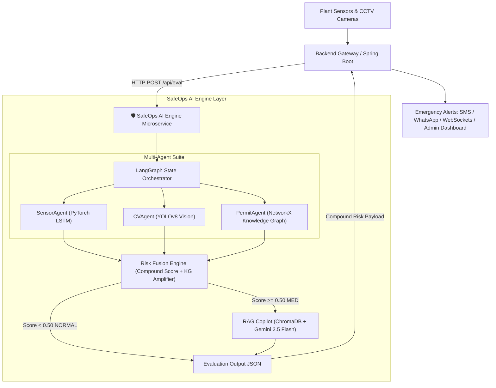

# 🛡️ SafeOps AI Engine - Multi-Agent Industrial Safety Microservice

> **AI-Powered Multi-Agent Risk Orchestration & Regulatory Compliance Copilot for Industrial Plant Safety**

Hosted as a cloud microservice on **Hugging Face Spaces**, the **SafeOps AI Engine** ingests real-time plant telemetry (gas/temp/pressure sensors, camera PPE vision analytics, active work permits, and human fatigue risk factors), orchestrates an asynchronous multi-agent pipeline using **LangGraph**, and returns compound risk scores, spatial knowledge graph citations, and actionable emergency evacuation protocols.

---

## 🚀 Quickstart for Hackathon Evaluators (Run Demo in 60 Seconds)

Try the interactive disaster-prevention scenario replay (Vizag Coke Oven Battery Explosion Prevention):

```bash
# 1. Clone & setup virtual environment
git clone https://github.com/vivek3770/SafeOps-AI.git
cd SafeOps-AI
python -m venv .venv
source .venv/bin/activate  # On Windows: .venv\Scripts\activate
pip install -r requirements.txt

# 2. Run the Interactive Terminal Demo Replay (No API keys required for mock mode!)
python scripts/run_mock_demo.py

# 3. Test Live Hugging Face API Endpoint
python scripts/test_hf_api.py
```

---

## 🌟 Key Highlights & Innovation

- **🤖 LangGraph Multi-Agent Orchestration**: Asynchronous state-graph orchestrating 5 specialized AI agents.
- **📈 PyTorch LSTM Time-Series Anomaly Engine**: Predicts gas threshold breach time ($60\%$ LEL limit) from 60-second multivariate sensor history.
- **👁️ YOLOv8 Computer Vision Analytics**: Real-time CCTV detection for PPE compliance (`NO_HELMET`, `NO_VEST`, `NO_HARNESS`) inside hazard zones.
- **🕸️ NetworkX Spatial Knowledge Graph**: Maps plant zone topology, critical equipment (Coke Oven Battery, Transformers), and permit conflicts (e.g. Hot Work in gas hazard zone).
- **⚖️ Dynamic Risk Fusion Engine**: Mathematical weighted risk scoring ($0.0 - 1.0$) with Knowledge Graph risk amplification ($+0.10$).
- **📚 RAG Regulatory Compliance Copilot**: ChromaDB vector store powered by **Google Gemini 2.5 Flash** citing **OISD-STD-105** and **The Factories Act, 1948**.

---

## 🏗️ System Architecture



---

## 🤖 Multi-Agent Suite Breakdown

| Agent Module | Technology Stack | Hackathon Role & Function |
| :--- | :--- | :--- |
| **`SensorAgent`**<br>`src/agents/sensor_agent.py` | PyTorch, LSTM Autoencoder | Processes multivariate sensor history (Gas % LEL, Temp, Pressure) to detect anomalies & estimate breach time. |
| **`CVAgent`**<br>`src/agents/cv_agent.py` | YOLOv8, OpenCV | Analyzes CCTV frame metadata to detect PPE violations (`NO_HELMET`, `NO_VEST`) and headcount inside hazard zones. |
| **`PermitAgent`**<br>`src/agents/permit_agent.py` | NetworkX Directed Graph | Evaluates spatial knowledge graph for SIMOPS permit conflicts (e.g. Hot Work active in gas-contaminated zone). |
| **`RiskFusionEngine`**<br>`src/orchestrator/risk_fusion.py` | Mathematical Scoring Algorithm | Fuses sub-agent scores into a compound risk score (0.0–1.0) with $+0.10$ critical equipment amplification. |
| **`RAGAgent`**<br>`src/agents/rag_agent.py` | ChromaDB, Google Gemini 2.5 Flash | Queries OISD-105 & Factories Act regulations to output structured emergency action recommendations. |

---

## 🔌 API Quick Reference

### Live Endpoints
- **Hugging Face Live Space**: `https://monkey3770-safeops-ai-engine.hf.space`
- **FastAPI Local Server**: `http://localhost:7860/api/eval` (Swagger UI at `/docs`)

### Sample Request Payload (`POST /api/eval`)
```json
{
  "zone_id": "ZONE_3",
  "shift_risk_factor": 0.8,
  "sensor_raw_history": [
    [18.0, 28.0, 1.2],
    [38.0, 31.0, 1.24]
  ],
  "cv_raw_frame": {
    "zone_id": "ZONE_3",
    "workers_detected": 3,
    "violations": [{"worker_id": "W_101", "violation_type": "NO_HELMET"}]
  },
  "active_permits_raw": [
    {"permit_id": "HW_042", "type": "HOT_WORK", "zone_id": "ZONE_3"}
  ]
}
```

### Sample Response Payload
```json
{
  "zone_id": "ZONE_3",
  "action_taken": "TRIGGER_EVACUATION",
  "notifications_sent": ["SMS_SENT", "WHATSAPP_SENT", "IN_APP_PUSH"],
  "risk_fusion_out": {
    "score": 0.9542,
    "severity": "CRITICAL",
    "kg_amplified": true
  },
  "sensor_anomaly_out": {
    "current_value": 38.0,
    "severity": "CRITICAL",
    "trend": "RISING",
    "predicted_threshold_breach_minutes": 22
  },
  "permit_intel_out": {
    "conflicts": [{
      "conflict_type": "SIMULTANEOUS_HIGH_RISK",
      "risk_description": "OISD-105 Clause 4.3 violation: HOT_WORK permit active with gas 38.0% LEL.",
      "severity": "CRITICAL"
    }]
  },
  "rag_compliance_out": {
    "similar_incidents": [{
      "plant": "Visakhapatnam Steel Plant",
      "description": "Explosion in coke oven battery due to entrapped gas (38% LEL) during active Hot Work."
    }],
    "applicable_regulations": [{
      "regulation_id": "OISD-STD-105-Clause-4.3",
      "requirement": "Section 4.3 prohibits hot work in gas above 25% LEL."
    }],
    "recommended_actions": [
      "IMMEDIATE EVACUATION of all personnel in ZONE_3 to safe assembly points.",
      "Halt all welding and active Hot Work in Zone 3 immediately."
    ]
  }
}
```

---

## 📁 Repository Structure

```text
├── app.py                       # Hugging Face Gradio Application & Entrypoint
├── Dockerfile                   # Container Deployment Configuration
├── requirements.txt             # Python Package Dependencies
├── src/
│   ├── api_server.py            # FastAPI REST API Server
│   ├── config.py                # System Hyperparameters & Environment Settings
│   ├── agents/                  # PyTorch LSTM, YOLOv8, Knowledge Graph & RAG Agents
│   ├── database/                # ChromaDB Vector Store & Gemini Embeddings
│   ├── graph/                   # Plant Spatial Zone Topology (NetworkX)
│   ├── models/                  # PyTorch LSTM Autoencoder Architecture
│   └── orchestrator/            # LangGraph Master State Graph & Risk Fusion Engine
├── scripts/
│   ├── seed_rag.py              # Seeds ChromaDB with safety standards & incident reports
│   ├── train_lstm.py            # Trains PyTorch LSTM Sensor Anomaly Model
│   ├── run_mock_demo.py         # Terminal scenario replay script (Run this for quick evaluation!)
│   └── test_hf_api.py           # Gradio & REST API integration test script
└── tests/                       # Pytest Test Suite
```

---

## 🛠️ Local Engine Setup

```bash
# 1. Configure Environment Variables (.env)
GOOGLE_API_KEY=your_gemini_api_key
CHROMA_DB_PATH=./data/chroma_db

# 2. Seed Database & Train Model
python scripts/seed_rag.py
python scripts/train_lstm.py

# 3. Launch Local Server
python -m src.api_server
```

---

## 📜 Regulatory Standards Enforced
- **OISD-STD-105**: Work Permit System in Petroleum & Process Industries (Clauses 4.3 & 7.3.2).
- **The Factories Act, 1948**: Chapter IV Section 36 (Safety Provisions for Hazardous Gas Exposure & Confined Spaces).
- **OSHA 1910.120**: Emergency Response & Hazardous Waste Operations.

